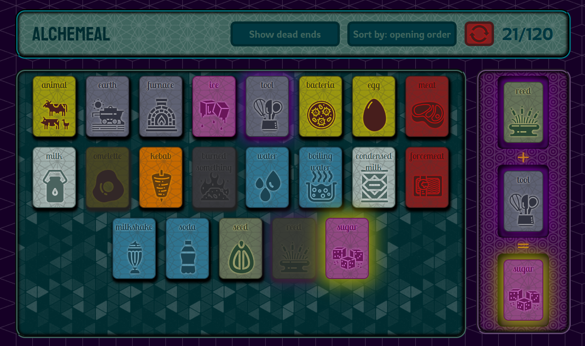
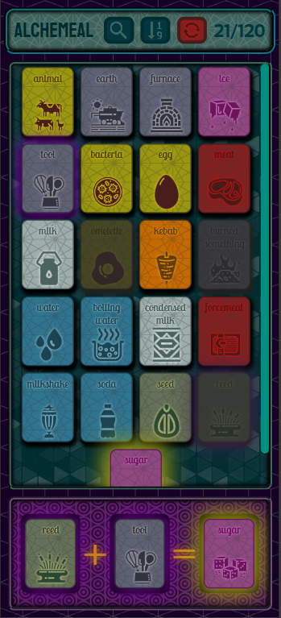

# Alchemeal

Welcome to **Alchemeal**, a logic-based crafting game built with React. Start with 5 basic elements, experiment with combinations, and discover the entire periodic table of your imagination!

<table><tr><td></td><td></td></tr></table>

## 🎮 Gameplay Mechanics

The game is divided into three functional areas:

### 1. Header & Controls

The top panel serves as your command center:

- **Progress Indicator:** Track how many elements you've discovered out of the total.
- **Sorting & Filters:** Organize your collection by **Alphabet**, **Element Type**, or **Unlock Order**.
- **Difficulty Settings:** Manage "Dead-end" elements (those that can't create anything new). You can mark them, hide them, or keep them visible for a harder challenge.
- **Credits:** Click the game title to see the icons' authors.
- **Reset:** A dedicated button to wipe progress and start from scratch.

### 2. The Mixing Table

Experimentation happens here. The table features **three slots**:

- **Slot 1 & 2:** Ingredients selected from your collection by clicking them.
- **Slot 3 (The Result):** Shows the outcome of the combination:
  - **Single Card:** A new or existing element discovered.
  - **List of Cards:** Some combinations yield multiple results!
  - **🛇 Symbol:** Indicates a failed experiment (no combination possible).
  - ✨ **Golden Glow:** Newly discovered elements are highlighted with a gold effect.

### 3. Collection Field

This is your library of discovered elements. Simply click a card in your collection to move it to the mixing table. You can toggle the visibility of "dead-end" cards from the header to clean up your workspace.

---

## 🛠 Tech Stack

This project was built to demonstrate modern frontend development practices:

- **Core:** [React](https://reactjs.org/) (Functional Components, Hooks)
- **State Management:** [Redux](https://redux.js.org/) (Handling complex crafting logic and progress persistence)
- **Type Safety:** [TypeScript](https://www.typescriptlang.org/)
- **Styling:** [SCSS](https://sass-lang.com/) (Modular styles)
- **Deployment:** [GitHub Pages](https://pages.github.com/)

---

## 🚀 Live Demo

Check out the game here: **[Alchemeal](https://pythongor.github.io/alchemeal/)**
